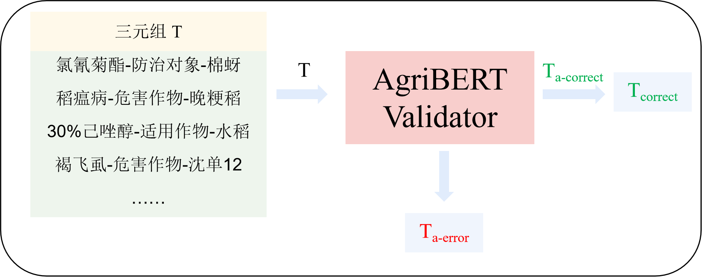
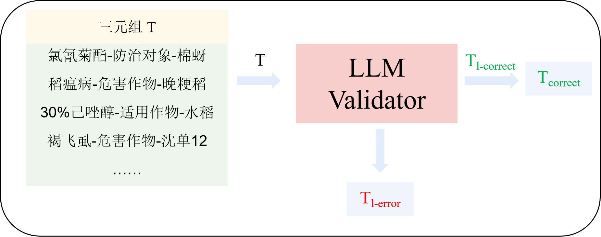

# AgriREV: An Agricultural Relation Extraction and Verification Framework by Integrating Large Language Models and Human-in-the-Loop?

Large Language Models (LLMs) have shown strong general-purpose abilities for tasks like summarization, QA and information extraction, but off-the-shelf models struggle in vertical, terminology-dense domains such as agricultural pest and disease texts―where entity names are nested or abbreviated, relation cues span sentences/paragraphs, and document styles vary (papers, manuals, field reports). To address domain drift, hallucination and sentence-level fragmentation, AgriREV implements a  **two-stage, instruction-tuned pipeline** : (1) an LLM fine-tuned with structured instruction templates to **filter relevant passages, perform NER, and generate candidate relation triples** under type/direction constraints; and (2) a multi-stage **verification workflow** (AgriBERT discriminator + LLM reasoning validator + optional human-in-the-loop) that systematically de-noises and verifies triples. This design improves cross-sentence/paragraph understanding, reduces false positives, and yields more explainable, high-confidence knowledge suitable for building agricultural knowledge graphs and decision-support systems.


# Complete Directory Structure

```
AgriREV/
├── API/                     # Model API interfaces and invocation utilities
├── configs/                 # Configuration files (training / inference / experiments)
├── dataset/                 # Dataset definitions and preprocessing modules
├── metric/                  # Directory for evaluation outputs and metrics
├── output/                  # Model predictions and inference results
├── validator/               # Triple validation modules
│   ├── AgriBERT_validator/  # Discriminative validator based on AgriBERT
│   │   ├── data/               # Validation datasets
│   │   ├── model/              # Saved checkpoints / trained weights
│   │   ├── config.py           # Validator configuration
│   │   ├── inference.py        # Validation / prediction script
│   │   ├── main.py             # Training entry point
│   │   ├── model.py            # Model architecture definition
│   │   ├── requirement.txt     # Dependency list
│   │   ├── test.py             # Testing / debugging utilities
│   │   ├── utils.py            # Data processing helpers
│   ├── LLM_validator/       # Reasoning-based validator using LLMs
│   │   ├── configs/            # Validator configuration files
│   │   ├── dataset/            # Validation datasets
│   │   ├── metric/             # Evaluation outputs
│   │   ├── output/             # Validator predictions
│   │   ├── finetune.py         # Instruction fine-tuning script
│   │   ├── inference.py        # Validation / inference script
│   │   ├── metric.py           # Evaluation utilities
├── finetune.py              # Main instruction fine-tuning entry
├── inference.py             # Main inference pipeline
└── metric.py                # Evaluation utilities / metrics computation
```

# 微调

## 模型微调 finetune.py

```bash
export NCCL_P2P_DISABLE=1
export NCCL_IB_DISABLE=1
torchrun \
  --nproc_per_node=4 \
  --master_port=29601 \
  finetune.py \
  --model_dir /root/autodl-tmp/models/chatglm3-6b \
  --data_dir dataset \
  --config_file configs/lora.yaml
```

## 推理抽取 inference.py

```bash
CUDA_VISIBLE_DEVICES=0,1,2,3 torchrun --nproc_per_node=4 inference.py \
    --model_dir lora/checkpoint-10419 \
    --data_dir ./dataset \
    --data_file test.json \
    --batch_size 16 \
    --output_prefix pred
```

## 预测结果

```
output/pred.json
```

## 评估结果

```
metric/metric.json
```

## 三元组验证

### Workflow-1 → AgriBERT Validator



### Workflow-2 → LLM Validator



### Workflow-3 → LLM + Human


验证工作流设计：

| 工作流                | 特点         | 适用场景     |
| --------------------- | ------------ | ------------ |
| AgriBERT Validator    | 高效批量筛选 | 大规模预处理 |
| LLM Validator         | 深度语义推理 | 复杂文本     |
| LLM Validator + Human | 最高可信度   | 知识库入库   |
